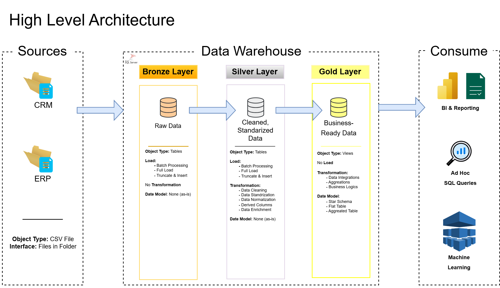
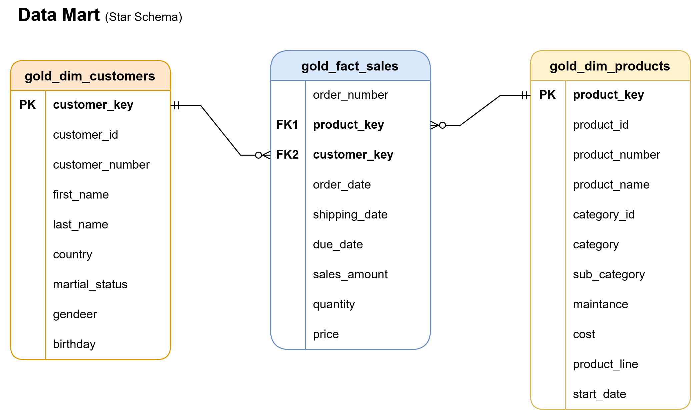

# SQL Data Warehouse

A modern SQL Server data warehouse project built using Medallion Architecture (Bronze, Silver, and Gold layers). The project integrates CRM and ERP data, applies ETL processes, and delivers a Star Schema model optimized for analytical reporting.

## 📌 Project Overview

This project involves:

1. **Data Architecture**: Designing a Modern Data Warehouse Using Medallion Architecture **Bronze**, **Silver**, and **Gold** layers.
2. **ETL Pipelines**: Extracting, transforming, and loading data from source systems into the warehouse.
3. **Data Modeling**: Developing fact and dimension tables optimized for analytical queries.
4. **Analytics & Reporting**: Creating SQL-based reports and dashboards for actionable insights.

This repository is an excellent resource for professionals and students looking to showcase expertise in:
- SQL Development
- Data Architect
- Data Engineering  
- ETL Pipeline Developer  
- Data Modeling  
- Data Analytics  

---

## 🚀 Project Highlights

* Built a multi-layer Data Warehouse using Bronze, Silver, and Gold architecture
* Integrated CRM and ERP source systems
* Developed ETL pipelines using SQL Server
* Designed a Star Schema for analytical reporting
* Created business-ready fact and dimension tables
* Documented data architecture, data model, and data dictionary

---
## 🛠️ Tech Stack

This project was built using the following tools and technologies:

* 🗄️ **SQL Server** – Data warehouse platform
* 💻 **SQL Server Management Studio (SSMS)** – Database development and administration
* 🌿 **Git** – Version control
* 📂 **GitHub** – Project repository and documentation
* 📊 **Draw.io** – Data architecture and data model diagrams
* 📝 **Notion** – Project Planning & Documentation
  
---

## 🎯 Project Requirements

### Building the Data Warehouse (Data Engineering)

#### Objective
Develop a modern data warehouse using SQL Server to consolidate sales data, enabling analytical reporting and informed decision-making.

#### Specifications
- **Data Sources**: Import data from two source systems (ERP and CRM) provided as CSV files.
- **Data Quality**: Cleanse and resolve data quality issues before analysis.
- **Integration**: Combine both sources into a single, user-friendly data model designed for analytical queries.
- **Scope**: Focus on the latest dataset only; historization of data is not required.
- **Documentation**: Provide clear documentation of the data model to support both business stakeholders and analytics teams.

---
## 🏗️ Data Architecture

The data architecture for this project follows Medallion Architecture **Bronze**, **Silver**, and **Gold** layers:


1. **Bronze Layer**: Stores raw data as-is from the source systems. Data is ingested from CSV Files into SQL Server Database.
2. **Silver Layer**: This layer includes data cleansing, standardization, and normalization processes to prepare data for analysis.
3. **Gold Layer**: Houses business-ready data modeled into a star schema required for reporting and analytics.

---
## 📊 Data Model 

The **Gold layer** follows a Star Schema design, consisting of one fact table and two dimension tables:


1. **gold_fact_sales**: Stores transactional sales data and business metrics.
2. **gold_dim_customers**: Contains customer-related attributes.
3. **gold_dim_products**: Contains product-related attributes.

The fact table is linked to the dimension tables through surrogate keys (customer_key and product_key), allowing users to analyze sales performance across different customers and products.

This design improves query efficiency and provides a business-friendly structure for reporting and analytics.

---

## 📂 Repository Structure

```text
sql-data-warehouse/
│
├── 01_datasets/                          # Raw datasets used for the project (ERP and CRM data)
│
├── 02_scripts/                           # SQL scripts for ETL and transformations
│   ├── 01_bronze/                        # Scripts for extracting and loading raw data
│   ├── 02_silver/                        # Scripts for cleaning and transforming data
│   └── 03_gold/                          # Scripts for creating analytical models
│
├── 03_tests/                             # Test scripts and quality files
│ 
├── 04_docs/                              # Project documentation
│   ├── 01_naming_conventions.md          # Naming guidelines for tables, columns, and files
│   └── 02_data_dictionary.md             # Data dictionary of datasets, including field descriptions and metadata
│   
├── 05_diagrams/                          # Project architecture details
│   ├── 01_high_level_architecture.png    # Diagram shows the project's architecture
│   ├── 02_data_flow.png                  # Data flow diagram
│   ├── 03_data_integration.png           # Data integration diagram
│   └── 04_data_model.png                 # Diagram shows the data models (star schema)
│
├── .gitignore
│
├── LICENSE
│
└── README.md
```
---
## 🚀 Key Learnings

- Built a multi-layer data warehouse using the Bronze, Silver, and Gold architecture.
- Learned how to design a Star Schema for analytical reporting.
- Developed ETL processes to clean, transform, and load data across different layers.
- Improved SQL skills through joins, window functions, and data transformation techniques.
- Gained practical experience in data modeling and dimensional design.
- Learned how to document a data project using GitHub and industry-standard project structure.

## ⚡Challenges Faced

* Understanding the different responsibilities of the Bronze, Silver, and Gold layers within a Medallion Architecture.
* Learning the differences between normalized data models and Star Schema design for analytical workloads.
* Determining which attributes should belong in dimension tables versus fact tables.
* Designing a Star Schema that supports reporting while remaining simple and maintainable.
* Working with data from multiple source systems (CRM and ERP) and ensuring consistency during transformation.
* Applying advanced SQL concepts such as CTEs and Window Functions in real-world transformation scenarios.
* Organizing SQL scripts, documentation, and project assets into a structured and maintainable repository.

## 💭 Personal Reflection

Before starting this project, my SQL knowledge was primarily focused on query writing and database operations. While I was comfortable with concepts such as joins, aggregations, and basic data transformations, I had limited exposure to data warehousing and dimensional modeling.

Building this project helped me understand how raw data is transformed into business-ready datasets through the Bronze, Silver, and Gold layers. More importantly, I gained practical experience in Star Schema design, ETL development, surrogate keys, and organizing data for analytical reporting.

This project marked an important step in my transition from learning SQL syntax to understanding how data platforms are designed to support business intelligence and decision-making.

---
## 👨‍💻 About Me

Hello! I'm **Wing Wong**. I’m passionate about working with data! Let's connect!

## 📜 License

This project is licensed under the [MIT License](LICENSE). You are free to use, modify, and share this project with proper attribution.
